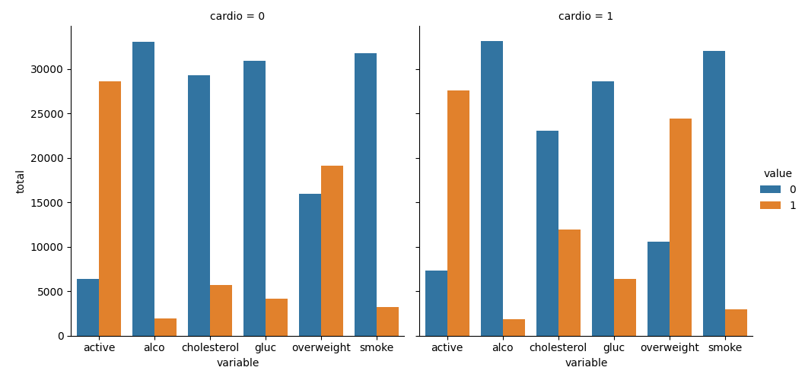
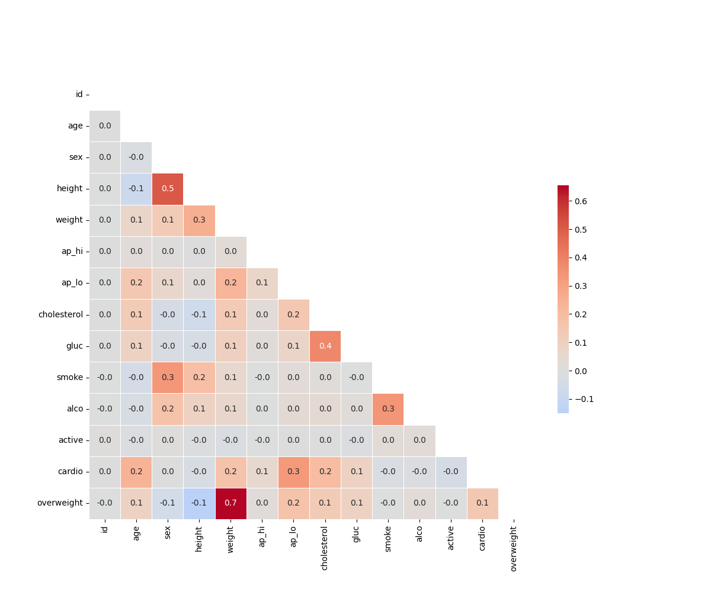

# 🩺 Medical Data Visualizer

A data visualization project built using **Python**, **Pandas**, **Matplotlib**, and **Seaborn** as part of the **FreeCodeCamp Data Analysis with Python** certification.

The project analyzes a medical examination dataset and generates two visualizations:

- 📊 Categorical Plot (Cat Plot)
- 🔥 Correlation Heat Map

---

## 📂 Project Structure

```
medical-data-visualizer/
│
├── catplot.png
├── heatmap.png
├── medical_data_visualizer.py
├── medical_examination.csv
├── requirements.txt
└── README.md
```

---

## 📖 Dataset

The project uses the **Medical Examination Dataset**, which contains information about patients including:

- Age
- Gender
- Height
- Weight
- Blood Pressure
- Cholesterol
- Glucose
- Smoking Habit
- Alcohol Consumption
- Physical Activity
- Cardiovascular Disease

---

## 📊 Project Tasks

### 1. Data Preprocessing

The dataset is cleaned by:

- Calculating the Body Mass Index (BMI)
- Creating a new **overweight** column
- Normalizing the **cholesterol** column
- Normalizing the **glucose** column

---

### 2. Categorical Plot

The categorical plot compares patients with and without cardiovascular disease using:

- Active lifestyle
- Alcohol consumption
- Cholesterol level
- Glucose level
- Overweight status
- Smoking habit

The plot is generated using **Seaborn's `catplot()`**.

Output:

- `catplot.png`

---

### 3. Correlation Heat Map

The heat map:

- Removes invalid blood pressure values
- Removes height and weight outliers
- Computes the correlation matrix
- Displays correlations using a masked heat map

The visualization is generated using **Seaborn's `heatmap()`**.

Output:

- `heatmap.png`

---

## 🛠️ Technologies Used

- Python
- Pandas
- NumPy
- Matplotlib
- Seaborn

---

## 📦 Installation

Clone the repository:

```bash
git clone https://github.com/basak-saptarshi/Data-Analysis-with-Python.git
```

Move to the project directory:

```bash
cd Data-Analysis-with-Python/medical-data-visualizer
```

Install the required libraries:

```bash
pip install -r requirements.txt
```

---

## ▶️ Run the Project

Execute the Python script:

```bash
python medical_data_visualizer.py
```

The program generates:

- `catplot.png`
- `heatmap.png`

---

## 📸 Output

### Categorical Plot



### Correlation Heat Map



---

## 📚 Concepts Practiced

- Data Cleaning
- Feature Engineering
- Data Transformation
- Correlation Analysis
- Data Visualization
- Pandas
- NumPy
- Matplotlib
- Seaborn

---

## 🎯 Learning Outcome

Through this project, I learned how to:

- Clean and preprocess real-world datasets
- Transform data using Pandas
- Create categorical visualizations
- Build correlation heat maps
- Identify relationships between medical variables
- Work with Python data analysis libraries

---

## 📄 License

This project was created for educational purposes as part of the **FreeCodeCamp Data Analysis with Python** certification.
